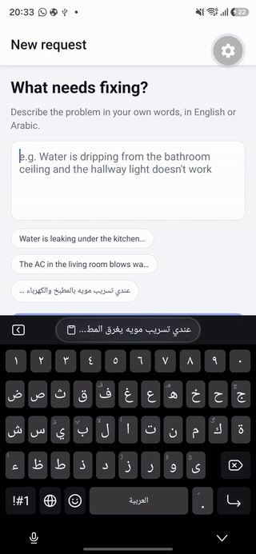

# FixIt – AI-assisted maintenance requests

A small feature for an app that connects customers with craftsmen. The customer
describes a problem in plain language (English or Arabic), the AI suggests a
**category** and a **priority**, the customer can edit both, and the request is
saved to a **Requests** list. If one message describes several problems, the AI
splits it into several requests automatically.

There are **two clients and one backend**:

- a mobile-first **web app** (Next.js) — the baseline requirement
- a **native mobile app** (React Native via Expo) — the optional bonus
- one **backend** (Next.js route handlers) that both call, and that holds the API key

Screens, in both clients:

| describe the problem | review and edit | list |
|---|---|---|
| text box, Submit button | one card per detected problem, editable category and priority | all saved requests with category, priority and date |

## Demo

One Arabic sentence describing three unrelated problems, split into three
requests with their own category and priority, edited, then saved.

<p align="center">
  
</p>

<p align="center"><em>The mobile app (React Native / Expo) on a Samsung S25.</em></p>

---

## Run it locally

Requirements: Node.js 20 or newer.

### Web app (and the backend)

```bash
git clone <this repo>
cd fixit
npm install
cp .env.example .env.local      # then put your Gemini key in .env.local
npm run dev
```

Open http://localhost:3000.

### Mobile app (optional)

The backend above must be running first, because the phone calls it.

```bash
cd mobile
npm install
npx expo start
```

Then install **Expo Go** on an Android phone from the Play Store, put the phone on
the same Wi-Fi as the computer, and scan the QR code that `expo start` prints.

No IP address needs configuring. The app reads the address it was served from
(`Constants.expoConfig.hostUri`) and swaps in port 3000 to find the backend. To
point it somewhere else, set `EXPO_PUBLIC_API_URL` in `mobile/.env`.

**Without an API key** the app still runs: it falls back to a built-in mock
classifier (see "AI provider" below). A yellow banner tells you when the mock
is active.

**With a key:** get a free Gemini key at https://aistudio.google.com/apikey
and set `GEMINI_API_KEY=...` in `.env.local`. Restart `npm run dev` after
changing env vars.

Other commands: `npm run lint`, `npx tsc --noEmit`, `npm run build && npm start`.

---

## How it works

```
Clients                         Server (Next.js route handlers)         External
─────────────────────────       ─────────────────────────────────       ────────
Web: NewRequestForm
Mobile: src/app/index.tsx
  │  (both call the same two endpoints)
  │ POST /api/analyze {text} ─► api/analyze/route.ts
  │                               └► lib/ai/provider.ts  getProvider()
  │                                    ├► lib/ai/gemini.ts ───────────► Gemini API
  │                                    └► lib/ai/mock.ts   (no key)
  │ ◄─ {provider, suggestions[]}
  │  user edits category / priority / text, removes over-splits
  │ POST /api/requests {items} ─► api/requests/route.ts
  │                               └► lib/storage.ts ──► data/requests.json
  ▼
/requests page (server component) ─► lib/storage.ts listRequests()
```

Key files:

| File | What it does |
|---|---|
| `src/lib/types.ts` | The allowed categories and priorities, and the shared TypeScript types. Add a category here and it appears everywhere. |
| `src/lib/ai/prompt.ts` | The system prompt and the JSON schema the model must follow. All "AI behaviour" tuning happens here. |
| `src/lib/ai/provider.ts` | The `AiProvider` interface, the env-based choice between Gemini and mock, and output validation. |
| `src/lib/ai/gemini.ts` | The real provider. Calls Gemini with structured JSON output. |
| `src/lib/ai/mock.ts` | Keyword-based fallback so the app runs with no key. |
| `src/lib/storage.ts` | Reads and writes `data/requests.json`. |
| `src/app/api/analyze/route.ts` | `POST` endpoint the browser calls for classification. |
| `src/app/api/requests/route.ts` | `GET` and `POST` endpoints for saved requests. |
| `src/components/NewRequestForm.tsx` | The two-step submit flow (describe, then review and confirm). |
| `src/app/requests/page.tsx` | The Requests list (web). |
| `mobile/src/lib/api.ts` | The only place the mobile app touches the network. Works out the backend address automatically. |
| `mobile/src/app/_layout.tsx` | Bottom tab bar. Expo Router uses file-based routing, same idea as the Next.js app directory. |
| `mobile/src/app/index.tsx` | The mobile submit flow. |
| `mobile/src/app/requests.tsx` | The mobile Requests list, with pull-to-refresh. |

---

## Technical decisions and why

**Next.js (App Router) for both frontend and backend.**
The brief requires that the API key never reaches the browser, which means
a backend is mandatory. Next.js route handlers give me that backend inside
the same project: one language, one `npm run dev`, one deploy. A separate
Express or FastAPI server would have worked too but adds a second process
for reviewers to run with no benefit at this size.

**Gemini as the LLM, with a mock fallback.**
Gemini has a free tier with no credit card, supports structured JSON output
natively, and handles Arabic well. The provider is behind a small interface
(`AiProvider`), so swapping to OpenAI or Claude is one new file plus one
line in `getProvider()`. The mock runs automatically when no key is set, so
the app is always runnable and the UI can be developed offline.

**One AI call returns an array, so splitting and classifying is one step.**
Instead of first asking "how many problems?" and then classifying each,
the prompt asks for a list of problems, each with its own category,
priority and a one-sentence reason. One call is cheaper, faster, and the
model has full context when deciding whether two sentences are one problem
or two. The prompt explicitly says "if in doubt, do NOT split", and the UI
lets the user remove a request if the model over-splits.

**Structured output via JSON schema, then validated again in code.**
`responseJsonSchema` forces the model to return valid JSON with the enum
values we expect. `normalizeSuggestions()` still checks every field and
coerces anything unexpected to `other` / `normal`, because a UI should never
crash on model output.

**The "reason" field.**
Not required by the brief, but showing *why* the AI chose urgent builds trust
and makes it obvious to the user when to override. It also made prompt
tuning much faster during development.

**JSON file for storage.**
The brief allows memory, JSON or SQLite. Memory loses data on every code
change in dev; SQLite needs a native module and a schema. A JSON file is
readable, survives restarts, and is trivially inspectable during a review.
Writes are queued so concurrent saves can't corrupt the file. All storage
access goes through two functions in `storage.ts`, so a real database is a
drop-in replacement.

**Server Component for the Requests page, Client Component for the form.**
The list page has no interactivity, so it reads the JSON file directly on
the server and ships zero client-side fetching code. The form holds state
and handles clicks, so it must be a Client Component. This is the standard
Next.js split and keeps the client bundle small.

**A `GET /api/requests` endpoint exists even though the web UI doesn't use it.**
It costs five lines and means a future React Native or Flutter app can use
the same backend unchanged.

**React Native (via Expo) for the bonus mobile app, not Flutter.**
Both were allowed. React Native reuses what the web app already establishes:
the same language, the same React model, the same TypeScript shapes and the
same backend. Flutter would have meant a second language and a second mental
model for no gain here. Expo is the standard React Native toolchain and means
the app runs on a real device through Expo Go without installing Android
Studio or building an APK. The result is a genuine native app, not a web view.

**The mobile app is a client of the same backend, not of the web app.**
Adding mobile required *zero* backend changes, because `GET /api/requests`
already existed. That is the whole argument for having built the backend as
plain HTTP endpoints rather than putting the logic in server components only.

**Category chips on mobile instead of a dropdown.**
The web uses a `<select>`, which is the right native control in a browser. On a
phone a `<select>` opens a modal wheel for what is only seven options, so the
mobile screen shows them as tappable chips instead. Same data, different
idiom — the point of building a real native app rather than wrapping the web one.

**The mobile app mirrors `types.ts` instead of importing it.**
The two projects are separate npm packages with separate bundlers (Turbopack and
Metro), so there is no import path between them without converting the repo into
a workspace monorepo. For a two-screen demo I judged a mirrored file with a
pointer comment to be lower risk than restructuring the whole repo. It is the
one piece of duplication in the project and it is the first thing I would fix
with more time (see below).

**Mobile-first Tailwind.**
Every layout is written for a phone first (single column, full-width
buttons, stacked fields) and only gains side-by-side layout at the `sm:`
breakpoint. `dir="auto"` on text inputs and text display so Arabic renders
right-to-left without a language toggle.

**Model name is configurable, and why.**
The first default, `gemini-2.5-flash`, came back `404: no longer available to
new users` from a freshly created key, even though the models list endpoint
still advertised it. Google's error message pointed to `gemini-3.6-flash`,
which is what the app now defaults to. Because model names churn like this,
the name is read from `GEMINI_MODEL` in `.env.local` so a reviewer can swap it
without touching code if it happens again. The mock fallback means the app
never hard-fails when the model is unavailable, it just degrades.

**Input limits and error handling.**
Descriptions are capped at 2000 characters server-side. Every fetch has a
visible error state. AI failures return a friendly 502 rather than leaking
provider errors to the user.

---

## AI tools used

I used **Claude Code** (Anthropic's CLI agent) throughout. Specifically:

- **Planning:** discussed the brief with it before writing code. It helped me
  choose Next.js over a separate React + Express setup and Gemini over other
  free-tier providers, and pushed back on the idea that Next.js "gives you a
  mobile app for free" (it doesn't; mobile-first CSS and a native app are
  different things).
- **Scaffolding and boilerplate:** generated the project, the route handlers,
  the storage module and the Tailwind layout, which I then reviewed and
  adjusted.
- **Prompt design:** drafted the system prompt and JSON schema, including the
  "if in doubt, do not split" rule and the category definitions.
- **Mock provider:** generated the keyword lists (English and Arabic).
- **Verification:** ran the API routes with curl, the TypeScript compiler and
  ESLint after each change.
- **This README:** first draft was AI-generated, then edited by me.

Everything in the repo was reviewed by me and I can explain and modify any
part of it.

---

## What's missing / what I'd improve with more time

- **No automated tests.** I'd add unit tests for `normalizeSuggestions`,
  `mock.ts` and `storage.ts` (Vitest), and one API-level test per route.
- **No auth or per-user data.** All requests are in one shared list.
- **JSON file is single-instance.** Fine locally; a deployment with more than
  one server would need SQLite/Postgres. The storage interface is ready for it.
- **Rate limiting** on `/api/analyze`, since it spends API quota.
- **Request detail / status.** Real apps would have statuses (new, assigned,
  done) and let the user delete or edit a saved request.
- **Full Arabic UI with an RTL toggle.** Input and display already handle
  Arabic; the labels and buttons are English only.
- **Shared types between web and mobile.** `mobile/src/lib/types.ts` mirrors
  `src/lib/types.ts` by hand. I would convert the repo to an npm workspace with a
  `shared` package that both import, so the category list can only be defined once.
- **Mobile app depth.** The mobile app covers the same flow as the web app but
  has no offline cache and no deep links. It also needs the backend running on a
  reachable machine; deploying the backend would make it work anywhere.
- **Prompt evaluation set.** A small file of tricky inputs (one long problem
  vs two short ones, Arabic dialect, non-maintenance text) with expected
  outputs, run as a regression test whenever the prompt changes.
- **Streaming or optimistic UI.** Gemini Flash answers in 1–3 seconds, so a
  spinner was enough for now.
